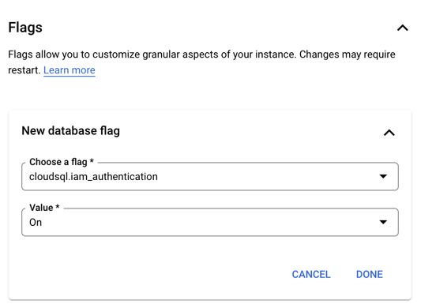
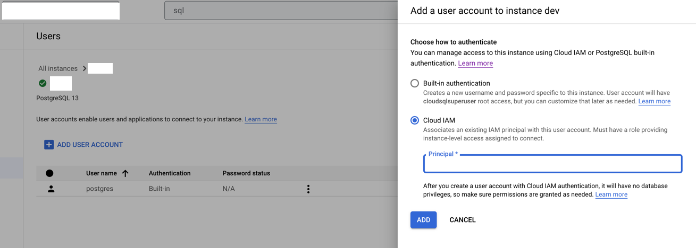

# GCP - Connecting to Cloud SQL using IAM authentication

## Table Of Contents

* [Introduction](#introduction)
* [Steps to configure IAM DB authentication](#steps-to-configure-iam-db-authentication)
* [How token based authentication works](#how-token-based-authentication-works)
* [Log in using IAM database authentication](#log-in-using-iam-database-authentication)
  * [Automatic](#automatic-iam-database-authentication)
  * [Manual](#manual-iam-database-authentication)
* [Links](#links)

## Introduction

Cloud SQL uses the following types of authentication for database users:

### The database's built-in authentication

- This approach uses a username and password to authenticate a database user.

### IAM database authentication

- This technique uses IAM to authenticate a database user by using an access token.

The problem with built-in authentication is that the passwords have to be rotated regularly. With IAM database authentication, we can login using the user/service account email Id. This requires no passwords and authentication tokens are short-lived.


## Steps to configure IAM DB authentication

### 1. Configure the instance for IAM database authentication

Add the below flag while creating a new Cloud SQL instance or update the existing instance. This will allow the Cloud SQL instance to accept IAM authentication.

```
cloudsql.iam_authentication=on
```



### 2. Add the user/service account as the database user

Navigate to "Console → SQL → Select Instance → Users → Add user account→ Cloud IAM → Enter email address → Add"



### Note:

* **Postgres:** For an IAM user account, this is the user's email address. For a service account, it is the service account's email without the `*.gserviceaccount.com` domain suffix.
* **MySQL:** For an IAM user account, this is the user's email address, without the “@” or domain name. For example, if the email address is `user@thoughtworks.com`, set the user argument to `user`. For a service account, this is the service account's email address without the `@<PROJECT_ID>.iam.gserviceaccount.com` suffix.

### 3. Grant required access to service account

The permission has to be granted in two levels,

- Instance level
- Database level

Grant `Cloud SQL Instance user` role to the service account. This allows service account users to log in to the instance. Now, the users can connect to the Cloud SQL instance and log in to the databases successfully.

For querying and modifying the database, we must grant access at the database level. After granting the access at database level, the service account user can access the database using IAM db authentication.

## How token based authentication works

When we are using IAM database authentication, the passwords will be replaced by short-lived access tokens. Instead of passwords, the access tokens for the service account which is added as the database user should be submitted to establish connection with the database. The authentication will fail when an access token for a different service account other than the database user service account is submitted.

Every application running in GCP will have a default service account. If the application is deployed in **App Engine** then **App Engine default service account** will be automatically created. Similarly, cloud run applications run on **Compute Engine default service account**. The service account keys are managed internally.So there is no need to create/rotate keys for the default service accounts. While authenticating with IAM database authentication, we can make use of these default service account, so that we need not worry about managing keys. We can add the default service account as database users and when the application submits the access-tokens for passwords, it will be submitted on behalf of the default service account. In scenarios, where a different service account other than the default service account needs to be added as database users, we can make use of [impersonation](#service-account-impersonation) which will help to avoid managing keys.

There can be two scenarios,

1. Default service account as database user (Directly provide the access token)
2. Other service account as database user (Impersonate and provide the access token)

## Log in using IAM database authentication

There are two types of IAM database authentication,

- [Automatic](#automatic-iam-database-authentication)
- [Manual](#manual-iam-database-authentication)

### Automatic IAM database authentication

In Automatic IAM database authentication, requesting and managing access tokens is taken care by an intermediary Cloud SQL connector. The Cloud SQL connectors are libraries that provide encryption and IAM-based authorization when connecting to a Cloud SQL instance. IAM database authentication uses OAuth 2.0 access tokens, which are short-lived and only valid for one hour. Cloud SQL connectors are able to request and refresh these tokens, ensuring that long-lived processes or applications that rely on connection pooling have stable connections. The connector submits the access token information for the password attribute on behalf of the client.

`When using a Cloud SQL connector with automatic IAM database authentication, the IAM account that you used to start the connector must be the same account that authenticates the database. The token will be submitted on behalf on the logged in service account(default service account).If the default service account is not the same as the database user service account,then we can make use of the impersonation option to authenticate.Click `[here](#service-account-impersonation) `to know more about impersonation.`

Currently, this feature is supported by,

- [Cloud SQL Auth proxy](#cloud-sql-auth-proxy)
- [Python connector](#python-connector)
- [Go connector](https://cloud.google.com/sql/docs/postgres/connect-connectors)
- [Java connector](https://cloud.google.com/sql/docs/postgres/connect-connectors#java)

#### Cloud SQL Auth proxy

One of the secure ways to connect to a Cloud SQL instance is via Cloud SQL Auth proxy. After installing the latest version of Cloud SQL Auth proxy binary(Click [here](https://cloud.google.com/sql/docs/postgres/connect-auth-proxy#install) to know how to install Cloud SQL Auth proxy), we then authenticate to the Google Cloud IAM.

**Default Service Account**

Below command will generate a unique token for our user account.

```
gcloud auth login
```

After the authentication is successful, we create the proxy connection to the Cloud SQL instance.

```
./cloud_sql_proxy -enable_iam_login  -instances=PROJECT:REGION:CLOUDSQL_INSTANCE_NAME=tcp:port
```

Once the connection is established, we can connect to the database using the user/service account database user. No password is required as it will be taken care of by the connector.

Check this [link](https://cloud.google.com/sql/docs/postgres/connect-auth-proxy#authentication-options) to understand about the options for authenticating Cloud SQL Auth proxy.

**With Impersonation**

The following commands can be used to impersonate service account and access the database.

```
gcloud auth login // autheticate using the default logged in service account
     
gcloud config set auth/impersonate_service_account <ACCOUNT_TO_BE_IMPERSONTED_FULL_EMAIL>
```

After impersonation, start the Cloud SQL Auth proxy and login to the database using the impersonated database username. Even though the logged in account is different,the authentication will be successful. This is because the connector will now submit the token for this impersonated service account and not the logged in service account.

#### Python Connector

We have to set the `enable_iam_auth=True` flag to true and now the connector _(Here we used cloud_sql_python_connector version [`1.1.0`](https://pypi.org/project/cloud-sql-python-connector/))_ itself will submit the token on behalf of the client for authentication. No need to specify the password in the connection config.

**Default Service Account**

In the below snippet, the connector will submit the token on behalf of the logged in default service account.

```python
from google.cloud.sql.connector import Connector
import sqlalchemy

def connect_db():
    connector = Connector()
    conn = connector.connect(
        os.environ['DB_INSTANCE_NAME'],
        "pg8000",
        user=os.environ['LOGGED_IN_SERVICE_ACCOUNT_USER'],
        db=os.environ['DB_NAME'],
        enable_iam_auth=True
    )
    return conn
```

**With Impersonation**

The following commands can be used to impersonate service account and connect to database.

```python
from google.cloud.sql.connector import Connector
from google.auth import impersonated_credentials
import sqlalchemy
import google.auth

credentials, project_id = google.auth.default()  // authenticate using the logged in service account
target_credentials = impersonated_credentials.Credentials(
    source_credentials=credentials,
    target_principal='SERVICE_ACCOUNT_TO_BE_IMPERSONATED-EMAIL',
    target_scopes=['https://www.googleapis.com/auth/cloud-platform'],
)     //impersonate service account

def connect_db():
    connector = Connector(
        credentials=target_credentials,
        enable_iam_auth=True
    )
    conn = connector.connect(
        os.environ['DB_INSTANCE_NAME'],
        "pg8000",
        user=os.environ['IMPERSONATED_SERVICE_ACCOUNT_USER'],
        db=os.environ['DB_NAME'],
    )     // connect using the impersonated service account database user
    return conn
```

After impersonation, the connector will submit the token for this impersonated service account and not the logged in service account.

### Manual IAM database authentication

Manual IAM database authentication requires the IAM principal to explicitly pass the access token for the password attribute in the client connection request. Principals must first log in to Google Cloud and explicitly request the access token from Google cloud. In manual authentication, we must first authenticate to Google Cloud, request an access token, and then connect to the database by passing in the token as the password for the IAM database user.

When you log in as a database user with manual IAM database authentication, you use your email address as the username and the access token as the password. OAuth 2.0 access tokens are short-lived and are only valid for one hour. Any new connections or logins created after this time fail. We need some token management to avoid downtime.

`The token should be submitted on behalf on the database user service account. If the logged in service account is not the same as the database user service account,then we can make use of the impersonation option to get the right token.Click` [here](#service-account-impersonation) `to know more about impersonation.`

Please find below the examples on how token management can be done in Node js applications which uses,

- [Sequelize ORM](#nodejs---sequelize)
- [Knex query builder](#nodejs---knex)

#### NodeJs - Sequelize

In Sequelize we can make use of the `BeforeConnect hook` to refresh our token. Before making a connection this hook will be called, and we can refresh the token inside this hook. For getting the token we can make use of the google-auth library. Impersonation is also possible. We can get the access token on behalf of the impersonated account and can use that to create a connection. The active connection will not fail even when the access token has expired.

```javascript
  sequelize = new Sequelize(
  {
    dialect: "postgres",
    host: `${database.dbInstanceName}`,
    port: database.dbPort,
    database: database.dbName,
    username: "LOGGED_IN_SERVICE_ACCOUNT_DB_USER" | "IMPERSONATED_SERVICE_ACCOUNT_DB_USER",
    password: database.dbPassword,
    hooks: {
      beforeConnect: async (config: DeepWriteable<Config>) => {
        config.password = (await getAccessToken(database.impersonateAccount)).token;
      },
    },
    pool: {
      max: 5,
      min: 0,
      acquire: 30000,
      idle: 10000,
    },
    dialectOptions: {
      socketPath: `${database.dbInstanceName}`,
    },
    logging: true,
  },
);
return sequelize;
}

```

```javascript
import { GoogleAuth, Impersonated } from "google-auth-library";

export async function getAccessToken(impersonateAccount: string): Promise<getAccessTokenResponse> {
  const auth = new GoogleAuth({
    scopes: ["https://www.googleapis.com/auth/cloud-platform"],
  });      // authenticate with logged in service account
  const client = await auth.getClient();
  const targetClient = new Impersonated({
    sourceClient: client,
    targetPrincipal: impersonateAccount,
    delegates: [],
    targetScopes: ["https://www.googleapis.com/auth/cloud-platform"],
  });   // impersonate service account 
  return targetClient.getAccessToken(); // if impersonation is required else auth.getAccessToken()
}

```

#### NodeJs - Knex

In knex builder, the `expirationChecker()` can be used to refresh the token.

```javascript
const createDBConnection = async () => {
  if (knex) {
    return knex;
  }
  const { database } = await getEnvVariables();
  const options = {
    client: "pg",
    connection: async () => {
      const {
        token,
        res,
      } = await getAccessToken(database.impersonateAccount);
      return {
        user: "LOGGED_IN_SERVICE_ACCOUNT_DB_USER" | "IMPERSONATED_SERVICE_ACCOUNT_DB_USER",
        database: database.dbName,
        host: database.dbInstanceName,
        instance: database.dbInstanceName,
        password: token,
        pool: {
          min: 0,
          max: 3,
          idleTimeoutMillis: 3000,
        },
        expirationChecker: () => (moment(res.data.expireTime) <= moment()),
      };
    },
  };
  knex = Knex(options);
};
```

### Service Account Impersonation

Consider `ServiceAccount B` is a database user and has access to cloud sql DB. `ServiceAccount A` is the default service account(Logged in service account). When we want to connect to the database using `ServiceAccount B`, we need to authenticate using `ServiceAccount B`. But without creating any service account key for `ServiceAccount B`, we can use service account impersonation to authenticate as `ServiceAccount B`. `ServiceAccount A` which is the already logged in service account, can impersonate `ServiceAccount B` and get the access token on behalf of `ServiceAccount B` . `ServiceAccount A` needs to be provided with `iam.serviceAccountTokenCreator` role for impersonating other service accounts. Now login as `ServiceAccount A` and use the specific commands to impersonate as `ServiceAccount B`.

After impersonation when we try to log-in to the database using the `ServiceAccount B` database username, the authentication will be successful,even though the logged in account is `ServiceAccount A`. This is because the connector will now submit the token for this impersonated service account not the logged in service account. Similarly, in case of manual DB authentication, the access token will be generated for the impersonated service account and not the logged in service account.

### Links

https://cloud.google.com/sql/docs/postgres/authentication                                 
https://cloud.google.com/sql/docs/postgres/iam-logins#log-in-with-automatic                         
https://cloud.google.com/sql/docs/postgres/iam-logins#logging-in-as-a-user                                      
https://cloud.google.com/kubernetes-engine/docs/how-to/workload-identity#authenticating_to                                   
https://cloud.google.com/sql/docs/mysql/connect-kubernetes-engine#:~:text=Workload%20Identity,-If%20you%20are&text=This%20method%20allows%20you%20to,your%20application%20in%20Google%20Cloud.
